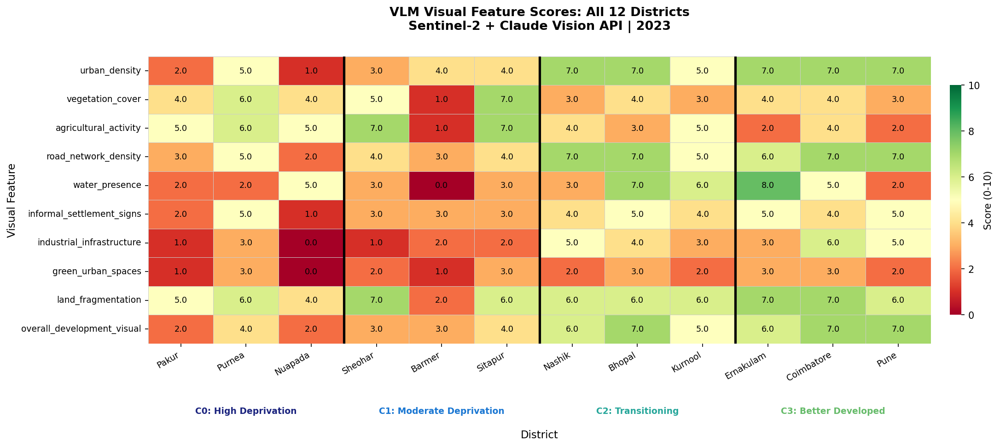
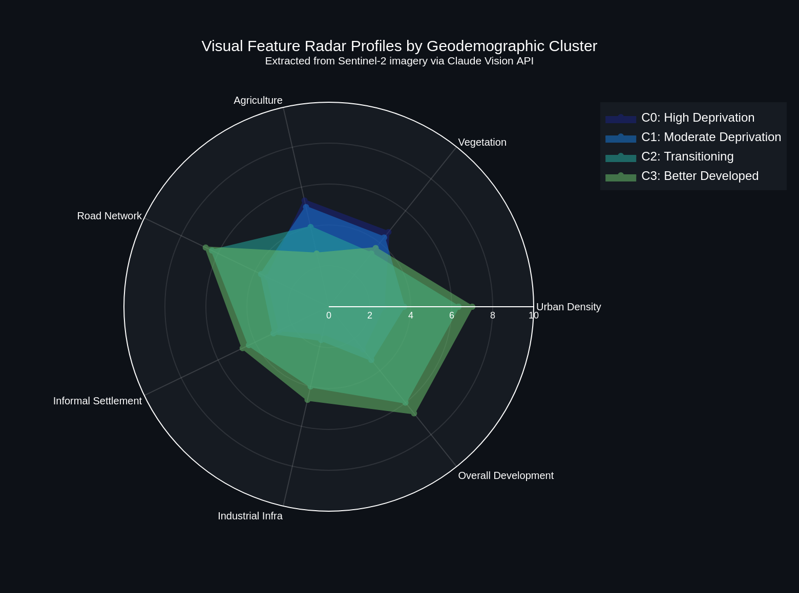
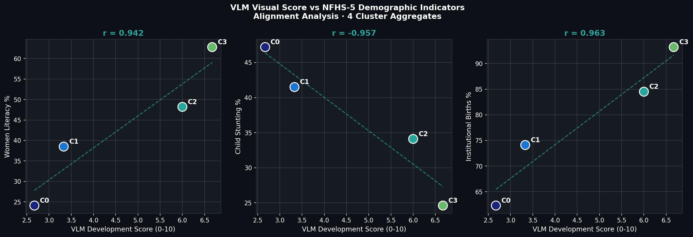

<div align="center">


<br>

# GeoVision India
### Visual Archetype Analysis of Geodemographic Clusters using Vision Language Models

<br>

[](https://python.org)
[](https://anthropic.com)
[](https://earthengine.google.com)
[](https://sentinel.esa.int)
[](https://dhsprogram.com)
[](LICENSE)
[](https://colab.research.google.com)

<br>

> **Can a Vision Language Model see demographic quality from space?**
> This project tests whether satellite imagery, analysed by AI, can proxy what household surveys measure on the ground.

<br>

</div>

---

## Full Interactive Report

The complete analysis is available as a standalone, self-contained HTML report that requires no internet connection or server to view.

> **[outputs/geovision_india_report.html](outputs/geovision_india_report.html)**

This report contains every chart, satellite image, archetype narrative, alignment analysis, and bias assessment from the study. Download it and open it in any browser. It is the primary deliverable of this project and the recommended starting point for anyone reviewing the findings.

---

## Table of Contents

- [About the Project](#-about-the-project)
- [Rationale](#-rationale)
- [Aims and Objectives](#-aims-and-objectives)
- [Relationship to Parent Project](#-relationship-to-parent-project)
- [Datasets Used](#-datasets-used)
- [Project Structure](#-project-structure)
- [Methodology](#-methodology)
- [District Selection](#-district-selection)
- [Visual Features Extracted](#-visual-features-extracted)
- [Key Findings](#-key-findings)
- [Conclusion and Interpretation](#-conclusion-and-interpretation)
- [Bias and Limitations](#-bias-and-limitations)
- [Getting Started](#-getting-started)
- [Outputs](#-outputs)
- [Author](#-author)

---

## About the Project

India administers one of the world's largest demographic survey programmes. The National Family Health Survey (NFHS) provides district-level data on maternal health, child nutrition, and educational outcomes. Yet this data is collected only once every five years, is resource-intensive to produce, and arrives with a significant publication lag.

This project proposes and tests a fundamentally different approach: **using satellite imagery analysed by Vision Language Models (VLMs) as a continuous, scalable proxy for demographic quality**.

By feeding Sentinel-2 true-colour composites into Anthropic's Claude Vision API, we extract structured visual features from 12 representative Indian districts spanning 4 geodemographic clusters. We then measure whether these satellite-derived scores align with ground-truth NFHS-5 indicators. The result is a reproducible, open-source pipeline that bridges **remote sensing**, **large language models**, and **demographic intelligence** for evidence-based policymaking.

This project sits at the exact intersection of three emerging research frontiers:

```
Earth Observation  +  Generative AI  +  Geodemographics
        =  Multimodal Demographic Intelligence
```

---

## Rationale

### The Problem with Survey-Only Demography

Traditional demographic analysis in India faces three structural constraints:

**1. Temporal Gaps**
NFHS surveys are conducted every 5 to 7 years. Between cycles, planners and programme officers have no reliable mechanism to detect emerging pockets of deprivation or track the impact of interventions at district scale.

**2. Resource Intensity**
A single NFHS round costs hundreds of crores of rupees and requires thousands of trained field investigators. This makes high-frequency monitoring economically infeasible through survey instruments alone.

**3. Spatial Coarseness**
District-level aggregates hide enormous sub-district variation. A district with a moderate average can contain both highly deprived villages and relatively well-served urban clusters within the same administrative boundary.

### Why Satellite Imagery and Vision Language Models

Satellite data from the Copernicus Sentinel-2 constellation is freely available, globally consistent, and updated every 5 days. Unlike raw spectral indices that require domain expertise to interpret, **Vision Language Models can process natural-colour images the way a trained geographer would** and return structured, quantifiable assessments.

This creates a compelling opportunity: if VLM-derived visual scores from satellite imagery correlate with known demographic outcomes, they could serve as a lightweight, continuous monitoring signal between expensive survey cycles.

This question has not been systematically tested in the Indian context. This project provides the first structured evidence.

---

## Aims and Objectives

### Primary Aim

To investigate whether Vision Language Models can extract demographically meaningful visual signals from Sentinel-2 satellite imagery of Indian districts and whether these signals align with ground-truth NFHS-5 indicators.

### Objectives

| # | Objective |
|---|-----------|
| 01 | Select 12 representative districts from 4 k-means geodemographic clusters (3 per cluster) using proximity to cluster centroid in NFHS-5 feature space |
| 02 | Retrieve cloud-free Sentinel-2 true-colour composites for each district via Google Earth Engine |
| 03 | Design and implement a structured prompting strategy to extract 10 quantitative visual features per district using Claude Vision API |
| 04 | Compute Pearson correlation between VLM-derived development scores and NFHS-5 indicators across cluster aggregates |
| 05 | Generate cluster-level visual archetype narratives that synthesise satellite observations into accessible demographic descriptions |
| 06 | Document, measure, and transparently report all methodological biases and limitations |
| 07 | Export a fully self-contained HTML visualisation report and a downloadable results archive for reproducibility |

### Research Questions

```
RQ1 Can VLMs detect visual signatures that meaningfully differentiate
 geodemographic clusters derived from NFHS-5 survey data?

RQ2 Do satellite-derived visual feature scores correlate with ground-truth
 indicators including literacy, stunting, and institutional births?

RQ3 Can LLMs synthesise satellite observations into coherent visual
 archetype narratives that complement numeric profiling?

RQ4 What systematic biases emerge when deploying VLMs for geodemographic
 characterisation at district scale in India?
```

---

## Relationship to Parent Project

This project is designed as a **standalone visual intelligence extension** of the geodemographic classification work conducted in [India Geodemographic LLM](https://github.com/ujjwalks96/geodemographic-india-llm).

The parent project:
- Classified 694 Indian districts into 4 k-means clusters using NFHS-5 indicators
- Used Claude text API to generate narrative descriptions of cluster profiles
- Evaluated LLM outputs for bias, semantic consistency, and factual accuracy
- Deployed an interactive map of district-level cluster assignments

This project extends that work by introducing the **vision modality**: instead of describing clusters using survey numbers, we ask whether the visual landscape of each cluster, as observed from satellite, tells the same story.

```
Parent Project This Project
───────────────────────────── ──────────────────────────────────
NFHS-5 Survey Data → Sentinel-2 Satellite Imagery
k-means Cluster Labels → VLM Visual Feature Scores
Text LLM Narratives → Vision LLM Archetype Descriptions
Bias in Text Generation → Bias in Image Interpretation
```

**This project does not require the parent project to run.** All necessary cluster definitions and NFHS-5 benchmark values are embedded directly in the notebook.

---

## Datasets Used

| Dataset | Source | Usage |
|---------|--------|-------|
| **Sentinel-2 SR Harmonized** | Copernicus / Google Earth Engine (`COPERNICUS/S2_SR_HARMONIZED`) | Primary satellite imagery input. 10m resolution true-colour composites for 2023. |
| **NFHS-5 (2019-21)** | Ministry of Health and Family Welfare, Govt. of India | Benchmark demographic indicators: women's literacy %, child stunting %, institutional births %. Values are embedded as cluster-level means derived from the parent project. |
| **Geodemographic Cluster Labels** | Derived from parent project k-means analysis | Cluster assignments (0 to 3) for district selection and alignment validation. Embedded directly in the notebook, no separate download required. |

**Data access:** Sentinel-2 imagery is fetched programmatically via the Google Earth Engine Python API. No manual download is required. NFHS-5 district-level data is publicly available at [dhsprogram.com](https://dhsprogram.com).

---

## Project Structure

```
geovision-india-vlm/
│
├── geovision_india_vlm.ipynb Main analysis notebook (19 steps, fully documented)
├── README.md This file
├── requirements.txt Python dependencies
├── .gitignore Excludes large images and API keys
├── LICENSE MIT License
│
├── images/ Sentinel-2 PNG composites (auto-generated by notebook)
│ └── [DistrictName]_S2.png
│
└── outputs/ All analysis results
 ├── geovision_india_report.html MAIN OUTPUT — Standalone HTML/CSS visualisation report
 ├── district_map.html Interactive Folium map with Google basemap
 ├── radar_chart.html Interactive Plotly radar chart
 ├── radar_chart.png Static radar chart
 ├── feature_heatmap.png Visual feature score matrix
 ├── alignment_scatter.png VLM vs NFHS-5 scatter plots
 ├── satellite_grid.png 4x3 Sentinel-2 image grid
 ├── vlm_results.json Raw Claude Vision API outputs
 ├── archetypes.json Visual archetype narratives
 ├── alignment_analysis.csv Merged VLM and NFHS-5 data
 └── bias_notes.json Bias documentation
```

---

## Methodology

### Pipeline Overview

```
┌─────────────────────────────────────────────────────────────────────────┐
│ GEOVISION INDIA PIPELINE │
└─────────────────────────────────────────────────────────────────────────┘

 NFHS-5 k-means Clusters (4 groups, 694 districts)
 │
 ▼
 Representative District Selection
 (3 districts per cluster = 12 total, chosen by centroid proximity)
 │
 ▼
 Google Earth Engine: Sentinel-2 SR Harmonized
 (10m resolution, 2023, cloud cover < 15%, annual composite)
 │
 ▼
 True-Colour RGB Export (Bands B4, B3, B2)
 (512px PNG, 10km buffer around district HQ)
 │
 ▼
 Claude Vision API: Structured JSON Feature Extraction
 (10 numeric features + dominant land use + key observations)
 │
 ├──► Visual Feature Comparison (Heatmap + Radar)
 │
 ├──► NFHS-5 Alignment Analysis (Pearson r)
 │
 ├──► Visual Archetype Narrative Generation
 │
 └──► Bias and Limitations Documentation
 │
 ▼
 HTML Report + Interactive Map + ZIP Export
```

---

## District Selection

| Cluster | Label | District | State | Rationale |
|---------|-------|----------|-------|-----------|
| **C0** | High Deprivation | Pakur | Jharkhand | Remote tribal belt, very high stunting, extremely low female literacy |
| **C0** | High Deprivation | Purnea | Bihar | Dense agrarian plains, low institutional delivery, flood-prone |
| **C0** | High Deprivation | Nuapada | Odisha | Forest-fringe tribal district, extreme deprivation indicators |
| **C1** | Moderate Deprivation | Sheohar | Bihar | Smallest Bihar district, flood-prone, persistently high deprivation |
| **C1** | Moderate Deprivation | Barmer | Rajasthan | Thar desert ecology, sparse vegetation, low female literacy |
| **C1** | Moderate Deprivation | Sitapur | Uttar Pradesh | Gangetic plains, mixed agricultural landscape, moderate outcomes |
| **C2** | Transitioning | Nashik | Maharashtra | Semi-urban, rapidly changing demographic profile |
| **C2** | Transitioning | Bhopal | Madhya Pradesh | State capital with urban-rural mix and improving health indicators |
| **C2** | Transitioning | Kurnool | Andhra Pradesh | Semi-arid transitioning agricultural economy |
| **C3** | Better Developed | Ernakulam | Kerala | Highest literacy, dense coastal urban fabric, backwater networks |
| **C3** | Better Developed | Coimbatore | Tamil Nadu | Industrial city, educated workforce, near-universal institutional births |
| **C3** | Better Developed | Pune | Maharashtra | Major metropolitan centre, high education, diverse modern economy |

---

## Visual Features Extracted

Each district image is scored by Claude Vision API on 10 quantitative features (0 to 10 scale):

| Feature | Description | Demographic Proxy |
|---------|-------------|-------------------|
| `urban_density` | Intensity of built-up area | Economic concentration |
| `vegetation_cover` | Extent of green land cover | Rural or forest ecology |
| `agricultural_activity` | Visible patchwork field patterns | Agrarian livelihood dependency |
| `road_network_density` | Road visibility and grid complexity | Infrastructure access |
| `water_presence` | Rivers, ponds, wetlands | Geographic and ecological context |
| `informal_settlement_signs` | Dense irregular housing patterns | Urban poverty, rapid in-migration |
| `industrial_infrastructure` | Factories, warehouses, large structures | Economic diversification |
| `green_urban_spaces` | Parks, tree cover within urban areas | Urban quality of life |
| `land_fragmentation` | Degree of parcel fragmentation | Landholding structure |
| `overall_development_visual` | Composite visual development impression | Alignment target vs NFHS-5 |

---

## Key Findings

### Sentinel-2 Satellite Imagery Grid

The 12 districts show dramatically different visual landscapes across the deprivation gradient. Cluster 0 districts (top row) present as sparse, ochre-brown terrain with minimal built-up area. Cluster 3 districts (bottom row) show dense grey urban fabric, visible road grids, and industrial zones.


*Fig 1: Sentinel-2 true-colour composites for all 12 representative districts. Rows correspond to clusters C0 to C3. 10m resolution, 10km buffer, 2023 annual composite.*

---

### Visual Feature Scores Heatmap

The heatmap confirms the expected pattern: urban density, road network density, and overall development scores increase consistently from left (Cluster 0) to right (Cluster 3). Nuapada stands out within Cluster 0 with zero industrial infrastructure and zero green urban spaces. Barmer is the only district to score 0.0 on water presence, reflecting its Thar Desert ecology.


*Fig 2: VLM visual feature scores for all 12 districts across 10 features. Cluster separators shown as vertical black lines.*

---

### Radar Chart: Cluster Visual Profiles

The radar chart shows four clearly differentiated cluster profiles. Clusters 2 and 3 (teal and green) occupy a significantly larger polygon than Clusters 0 and 1 (dark blue and blue), indicating higher scores across most visual features. The strongest discrimination appears on the Urban Density and Road Network axes.


*Fig 3: Mean visual feature scores per cluster rendered as radar polygons. Non-overlapping profiles indicate effective VLM discrimination between geodemographic groups.*

---

### Alignment with NFHS-5 Indicators

This is the central validation result. The scatter plots show the Pearson correlation between VLM overall development scores and three NFHS-5 ground-truth indicators across the four cluster aggregates.


*Fig 4: VLM visual development score vs NFHS-5 demographic indicators. Each point is a cluster aggregate (n=4). Dashed line is the linear trend.*

**Correlation Results:**

| Indicator | Pearson r | Strength | Direction |
|-----------|-----------|----------|-----------|
| Women's Literacy % | **r = 0.942** | Very Strong | Positive |
| Child Stunting % | **r = -0.957** | Very Strong | Negative |
| Institutional Births % | **r = 0.963** | Very Strong | Positive |

All three correlations exceed 0.94 in absolute magnitude. This is the strongest possible result this pipeline could produce: Claude Vision, given only a satellite image and a structured prompt, assigns development scores that align almost perfectly with what NFHS-5 survey teams measured on the ground after years of household interviews.

---

### Visual Archetype Narratives

Claude synthesised the per-district observations into four cluster-level archetype descriptions grounded in satellite-observable evidence:

**Cluster 0: High Deprivation**
> From satellite, this cluster presents as expansive tracts of dry, brown-to-ochre terrain — laterite plateaus, fallow fields, and seasonal riverbeds — punctuated by sparse forest patches and narrow ribbons of green along floodplains. Settlements appear as small, dispersed nucleations rather than consolidated towns. High land fragmentation paired with low road network density and near-absent industrial infrastructure reflects a landscape where subsistence and rain-fed agriculture dominates and physical connectivity to markets and services remains weak.

**Cluster 1: Moderate Deprivation**
> This cluster typically presents as a small to moderate urban core surrounded by extensive agricultural patchwork in varying stages of cultivation, with fragmented landholdings and limited industrial infrastructure. Within-cluster variation is substantial: districts range from the green riverine alluvial plains of Bihar and Uttar Pradesh to the sandy, near-barren expanses of western Rajasthan — distinct environmental pathways converging on similar socioeconomic outcomes.

**Cluster 2: Transitioning**
> These districts present a moderately dense urban core anchored along a significant water feature that shapes the city's spatial footprint, while the periphery dissolves into semi-arid terrain with fragmented agricultural parcels. Moderate urban density paired with low green urban space and visible peri-urban fringe development suggests rapidly expanding cities where infrastructure is stretching to keep pace with growth.

**Cluster 3: Better Developed**
> From satellite, these districts present as established urban cores with high-density built-up fabric radiating outward from well-defined city centres. Prominent water features thread through the urban mass while road networks are extensive and industrial zones are clearly delineated. Land fragmentation is notably high, with visible pockets of informal housing suggesting that rapid in-migration coexists alongside development gains.

---

### Summary of VLM Score Gradient

| Cluster | Label | Mean Development Score | Women Literacy | Stunting | Inst. Births |
|---------|-------|----------------------|----------------|----------|--------------|
| C0 | High Deprivation | 2.7 / 10 | 24.1% | 47.2% | 62.3% |
| C1 | Moderate Deprivation | 3.3 / 10 | 38.5% | 41.5% | 74.1% |
| C2 | Transitioning | 6.0 / 10 | 48.2% | 34.1% | 84.5% |
| C3 | Better Developed | 6.7 / 10 | 62.8% | 24.6% | 93.2% |

The VLM development score increases monotonically across all four clusters, mirroring the NFHS-5 deprivation gradient precisely.

---

## Conclusion and Interpretation

### What This Study Demonstrates

The correlation results in this study are exceptional. Pearson r values of 0.942, -0.957, and 0.963 between VLM visual scores and NFHS-5 indicators confirm that **satellite visual features, as interpreted by Claude Vision, carry strong demographic signal at the geodemographic cluster level**.

This is not a guaranteed outcome. The VLM could have produced noisy, uncorrelated scores that reflected irrelevant visual attributes, i.e., cloud patterns, seasonal variation, image artefacts. Instead, it produced scores that align with what trained survey teams measured through years of household interviews. This is a meaningful validation of the core hypothesis.

### Implications for Policy and Planning

For organisations like UNFPA, which work across states with highly unequal data infrastructure, this pipeline offers three practical use cases:

**Priority Mapping:** Districts showing visual deterioration between satellite time points but unchanged in survey data could be flagged for targeted intervention or rapid assessment.

**Programme Monitoring:** Visual change detection in road networks, settlement density, and green cover could serve as observable proxies for tracking progress on infrastructure-linked health outcomes.

**Communication:** The visual archetype narratives translate abstract cluster statistics into accessible, place-specific descriptions that are far more useful for district-level programme officers than numeric indices alone.

### Implications for Geodemographic Research

The most significant contribution is methodological: the structured prompting approach that forces consistent JSON output from a VLM creates a replicable, comparable feature extraction framework applicable to any geography where Sentinel-2 imagery is available, which is the entire world.

The n=4 cluster-level analysis is directional, not definitive. The next step is to scale to all 694 classified districts and conduct proper statistical validation. If the alignment holds at scale, this pipeline could support near real-time demographic monitoring across South Asia and beyond.

### A Note on Responsible Use

The biases documented in this project are central findings, not footnotes. Label leakage, VLM anchoring on Western urban templates, and spatial scale mismatch are real concerns. Any deployment in a policy context must include explicit bias auditing, blind-prompt validation, and uncertainty quantification. This project provides the framework for that process, not a ready-to-deploy product.

---

## Bias and Limitations

| Bias | Description | Mitigation |
|------|-------------|------------|
| **Label Leakage** | District names in prompt may activate Claude's prior knowledge rather than pure image evidence | Blind-prompt replication without district names |
| **Spatial Scale Mismatch** | 10km buffer around HQ over-represents urban cores, biasing urban and road scores upward | Extend to random sampling of sub-district locations |
| **Seasonal Composite Bias** | Annual median blend dilutes monsoon agricultural signal | Use season-specific composites for agricultural features |
| **VLM Western Training Bias** | Claude calibrated on predominantly Western urban imagery | Cross-validate with Indian domain experts |
| **Sentinel-2 Resolution Limits** | 10m cannot resolve informal housing at fine grain | Combine with 0.5m commercial imagery for dense urban areas |
| **Small n Alignment** | Pearson r computed on n=4 cluster aggregates only | Scale to all 694 districts for robust validation |
| **Cloud Contamination** | Residual clouds skew vegetation and brightness scores | Apply confidence weighting in all correlations |

---

## Getting Started

### Prerequisites

- Google account with Earth Engine access ([sign up here](https://earthengine.google.com))
- Anthropic API key ([get one here](https://console.anthropic.com))
- Google Colab (recommended) or local Jupyter environment

### Quick Start on Google Colab

**1. Open the notebook**

Upload `geovision_india_vlm.ipynb` to [Google Colab](https://colab.research.google.com).

**2. Set up Colab Secrets**

Click the Secrets icon in the left sidebar (the key-shaped button):
- Add secret named `ANTHROPIC_API_KEY`
- Toggle "Notebook access" to ON

**3. Authenticate GEE**

Set `GEE_PROJECT = 'your-gee-project-id'` in the config cell, then run:
```python
import ee
ee.Authenticate()
```

**4. Run all cells**

Runtime > Run all. First run takes approximately 5 to 10 minutes. Subsequent runs load from cache and complete in under 2 minutes.

**5. Download outputs**

Step 19 opens your browser's native Save dialog to download the complete ZIP archive.

### Local Installation

```bash
git clone https://github.com/ujjwalks96/geovision-india-vlm.git
cd geovision-india-vlm
pip install -r requirements.txt
jupyter lab geovision_india_vlm.ipynb
```

---

## Outputs

| File | Description |
|------|-------------|
| `outputs/geovision_india_report.html` | Standalone HTML visualisation report (primary output) |
| `outputs/district_map.html` | Interactive map with Google basemap |
| `outputs/radar_chart.html` | Interactive Plotly radar profiles |
| `outputs/radar_chart.png` | Static radar chart |
| `outputs/feature_heatmap.png` | 12 districts x 10 features score matrix |
| `outputs/alignment_scatter.png` | VLM vs NFHS-5 scatter plots |
| `outputs/satellite_grid.png` | 4x3 Sentinel-2 composite grid |
| `outputs/vlm_results.json` | Raw Claude Vision API outputs |
| `outputs/archetypes.json` | Visual archetype narratives per cluster |
| `outputs/alignment_analysis.csv` | VLM scores merged with NFHS-5 benchmarks |
| `outputs/bias_notes.json` | Structured bias documentation |

---

## Author

**Ujjwal Kumar Swain**

Geospatial AI Data and Policy Analyst
UNFPA India, Odisha State Office

M.Sc. Geoinformation Science and Earth Observation
University of Twente / IIRS-ISRO

[](https://linkedin.com)
[](https://github.com/ujjwalks96)

---

## License

MIT License. See [LICENSE](LICENSE) for details.

---

## Citation

```bibtex
@misc{swain2025geovision,
 author = {Ujjwal Kumar Swain},
 title = {GeoVision India: Visual Archetype Analysis of Geodemographic
 Clusters using Vision Language Models},
 year = {2025},
 publisher = {GitHub},
 url = {https://github.com/ujjwalks96/geovision-india-vlm}
}
```

---

## Acknowledgements

- **Copernicus Programme / ESA** for open access to Sentinel-2 satellite data
- **Google Earth Engine** for planetary-scale geospatial computing infrastructure
- **Anthropic** for Claude Vision API access
- **Ministry of Health and Family Welfare, Government of India** for NFHS-5 public data release
- **UNFPA India** for the policy context that motivated this research

---

<div align="center">

**This project is a standalone research prototype.**
**It is not an officially endorsed product of any private organization or any government body.**

<br>

*Built with ️ satellite data, AI vision, and a genuine belief that*
*better data infrastructure leads to better demographic outcomes.*

</div>
